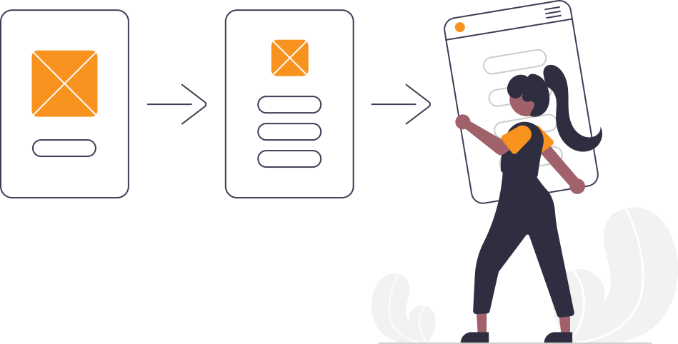
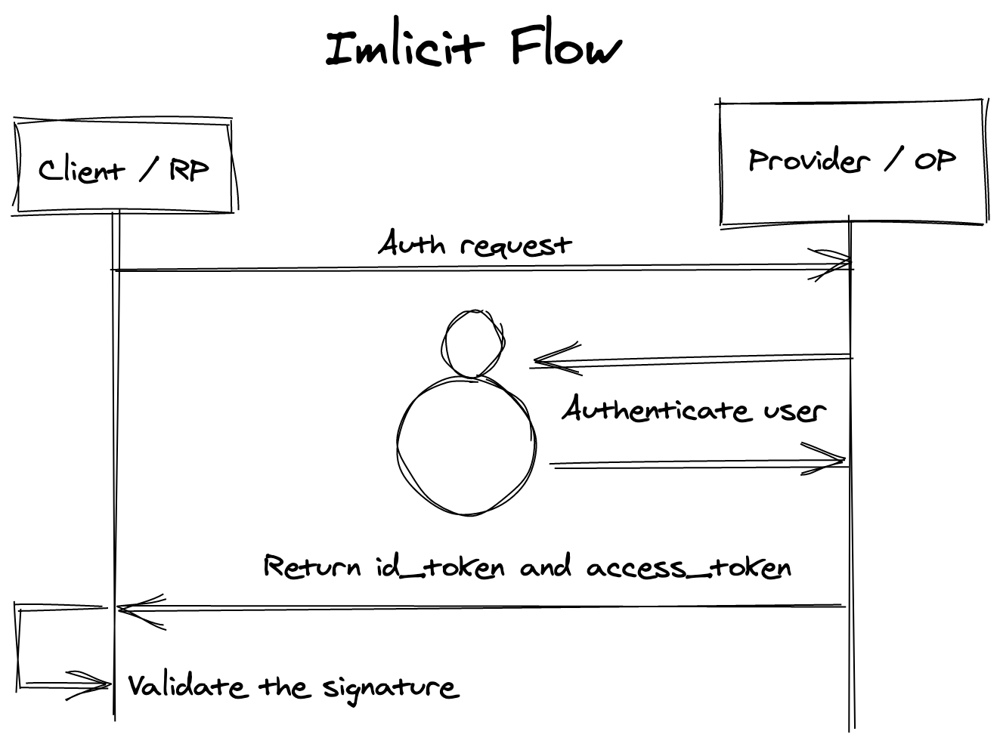

# OpenID Connect

Standard for delegated authentication

---

# Why OIDC?

- Open standard
- Easy to integrate

---

# How does it work?

Providers and Clients

<!--
Klient: Den applikation som vill logga in en användare/ha information om denna.

Provider: Autentiserar användaren och skickar information om denna till klienten -->

---

### Authentication flows

---

### Authentication flows

---

# OIDC at Xenit

- Xenit IDP (eID)
- Azure AD
- Central IDP (HSB)

<!--
På Xenit använder vi OIDC i Xenit IDP eller eID som den även kallas, dvs vår BankID-tjänst

Azure AD använder, bland annat, OIDC när man använder den för att logga in. Detta kan man se bland annat i Portalen.

HSB's Central IDP är en implementation av en Provider, precis som eID.
-->

---

# OCaml OIDC client

---

# Certification process

Build your library

Setup e2e tests

Complete all tests

Send results

---

# So what?

It **should** work with any implementation

(that follows the standard)

---

# JOSE

#### JavaScript Object Signing and Encryption

- ocaml-jwt
- jwto

Needed more than they provided
JWK is a important missing piece in both

---

# Links

https://openid.net/
OpenID Foundation

https://github.com/ulrikstrid/ocaml-oidc
OpenID Connect for OCaml and Reason

https://github.com/ulrikstrid/reason-jose
JWT, JWE and JWK for native

https://github.com/reason-native-web/morph
